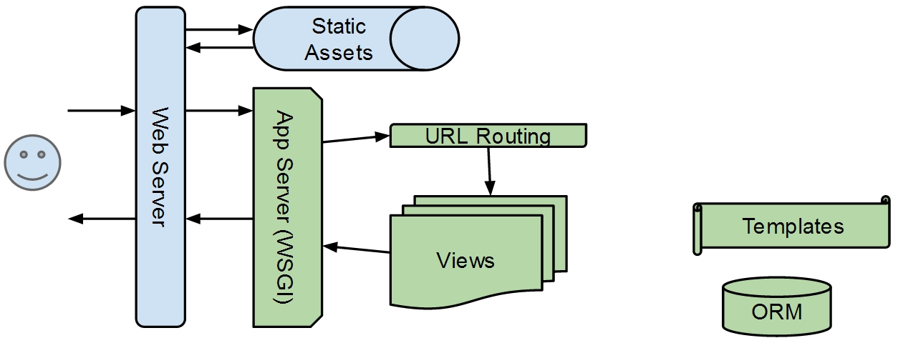

title: Melb Django School Slides
style: style.css
output: slides.html

-- extraxtsm

### How do web Apps work

## Hyper Text Transport Protocol

- HTTP - is the protocol that we use to communicate between client and server
	- basically how our browser communicates with a server.

### Client / Server

- Client makes `request` to Server
- Server sends `response` to Client.

-- sm blink

##One request - One response.

-- xtsm

## The Request

- HTTP Request line - contains the following:
	- Method - 5 main methods - GET, HEAD, POST, PUT, DELETE, OPTIONS, TRACE
	- URI - is the specific resource you're requesting (e.g. /index.html)
	- Protocol Version - is the version of HTTP (e.g. HTTP/1.1)
- HTTP Request Header: - is a list of key/value pairs that is about the request
	- Host - is the main key/value pair of the Request Header - It gives us our server location (e.g. example.com)
    - Accept - a list of content types the client can handle
- HTTP Request Body: - an option body message

-- xtsm hd6 custom1

## The Response

- HTTP Response Status-Line:
	- Protocol Version - is the version of HTTP (e.g. HTTP/1.1)
	- Status Code - (e.g. 200, 404)
	- Description - a brief description of the status code (e.g. ok, not found)
- HTTP Response Header: - is a list of key/value pairs that tells us about our response
    - Content Type - the sort of resource this is (image/jpeg, text/html, etc.)
    - Content Length - how long the response body is.
- HTTP Response Body:
	- The actual resource requested.

-- sm wd

####Request Response Diagram

-- md

### Application servers vs web servers

* "web server" is a general term for a program that answers HTTP requests.
* Typically it serves static content.
* An application server allows us to use business logic to generate content dynamically.
* Essentially the main difference is an app server allows us to dynamically change the http response instead of being connected to a file.

-- sm

### Let's get started!

## Installing Python
- Linux:
  - typically already installed
- Mac:
  - already installed
- Windows:
  - https://www.python.org/downloads/

##Python/Package Manager
- Installing Pip - Pip is a package manager used to install & manage python programs. Pip allows us to install Django and other python packages easily
- Download get-pip.py https://bootstrap.pypa.io/get-pip.py
- run python get-pip.py

--

### Virtualenv - keeping things tidy
- Helps avoid version clashes
- Separate package environment per env
- Every time you have a new django project, you want  to create it in a new VirtualEnv.
- Helps with consistancy: same package versions in development, testing, and production.

-- sm

##Installing VirtualEnv/Django

- Linux:
 - sudo pip install virtualenv
 - or your distro's package manager (i.e. sudo apt-get install python-virtualenv)
- Mac:
 - brew install python-virtualenv
 - sudo pip install virtualenv
- Windows:
 - pip install virtualenv

## Create/Activate Virtualenv

- Create Virtualenv- `$ virtualenv foo`
- Activate Virtualenv - `$ . foo/bin/activate` [Windows: foo/bin/activate.bat]
- You are now within your virtual environment. Anything you install with pip will be contained within this environment
- Install Django: - `$ pip install Django`

--

## Django - Start Project/Structure

- To create a new django project - `$ django-admin.py startproject <project name>`
- This command gives you the following out-of-the-box django file structure:

-- sm

## Django Project File Overview

- __Project Workspace: bproject/__  - is just a container for your project. Its name doesn't matter to Django; you can rename it to anything you like.  All Python imports for code in your project and apps are relative to here.
- __manage.py__ - A handy wrapper for django-admin.py for this project
- __Projet Module: bprojet/bproject/ - this is the Python module of your app.

--

## Django Project Module Files Overview

Inside your project module:

- __\_\_init\_\_.py__ - An empty file that tells Python that this directory should be considered a Python package
- __settings.py__ - Settings/configuration for this Django project
- __urls.py__ - The URL declarations for this Django project; a 'table of contents' of your Django-powered site.
- __wsgi.py__ - An entry-point for WSGI-compatible web servers to serve your project.

-- sm

##Django Settings

- Your settings file contains a bunch of variables declaring the configuration of your project
	- e.g. static file location & Time Zone
- Two Essential Setting Variables
	-  DEBUG - a boolean value that you set to True or False
		- When Debug is on (DEBUG = True), Django will display a detailed traceback on your error page, including metadata about your environment. This allows you to easily debugged your error.
	- INSTALLED_APPS - a tuple of python packages that your project can use.
		- Whenever you install a new python package (e.g. django-braces, django-rest-framework) you need to add it to your Installed Apps tuple to access it within your project.

-- md

## Django Project vs. App

- Project - is a collection of configuration and apps for a particular website
- App - An app is a Web application that does something – e.g. a Weblog system, a database of public records or a simple poll app
- A project can contain multiple apps and app can be in multiple projects.
- create an app by executing `python manage.py startapp <app name>`
- Whenever you add a new app to your project you need to add it your `INSTALLED_APPS` tuple to access it within your project.

-- sm  custom2 hd6-custom

## App File Structure/File overview

######Django App File Structure

- poll/ - your root app directory should sit in the same directory as your project root
- poll/\_\_init\_\_.py - makes your app into a python package
- mpyapp/admin.py - where you register your models to be viewed in your admin panel and customised how they will be displayed.
- migrations/ - stores a history of all your model migrations - it's a type of version control for changes to your model.
- models.py - where you write your the models for your application
- tests.py - where you write tests for your app
- views.py - controls how your server displays content to your client (browser or web service)

-- md

## Getting Started

- To run your projects/See it in a web browser - you have to execute the following commands:
	- `$ python manage.py migrate`- The migrate command looks at the INSTALLED_APPS setting and creates any necessary database tables according to the database settings in your mysite/settings.py file and the database migrations shipped with the app.
	- `$ python manage.py runserver` - Starts your Django development server, a lightweight Web server written purely in Python.
	- You could now go to `http://127.0.0.1:8000/` with your web browser and view your site.

-- extraxtsm

## How it comes together

- The browser via http makes a request to your server, using your input url as a resource
- The server then looks for a matching url in your urlconfigs file (urls.py)
- The matched url then calls a function or a class in the views.py file
- The view then displays a response to the browser

### Version Control

- Why?  Because we make mistakes.

- Using Git
	- Git is a version control program.
	- http://git-scm.com/downloads

-- sm

##Git Add/Commit

- Git allows you to choose how to wrap your file changes.
- For example, you've changed three files:
	- a url (urls.py),
	- its relevant view (views.py)
	- an unrelated change to your index.html.
- Ideally you would like to commit the urls.py & views.py changes together and index.html as a separate commit.
- Git facilitates this behaviour by first requiring you to place each change on a staging level. Here you could choose which file to set to staging (The urls.py & views.py). Then you could wrap all the files you’ve set to staging as one commit. Next you could stage and commit your change to the index.html.
- To see a list of all changed files that haven't been committed - `$git status`

-- md hd6

## Git Status

######Git Status Message

- To set a file to staged - `$git add <file name> ` or `$git add .` - adds all changes to staged
- To commit staged files - `$git commit -m <commit message>`

-- sm hd6 custom1 xtsm

## Git Log

######Git Log Message

- You could see a history of all your changes through the git log command - `$git log`
- This command shows a list of all your commits starting with the most recent.

--

## Github/Git Continued

- Github is a remote repository where you could store your code base. Github allows you to easily view your files & commit history and share your code base. [Go to github](https://github.com/)
- Git allows you to copy projects sitting on Github to your local computer (essentially sharing your code base) by using the git clone command. - `$ git clone <project url>`
- You could then get any new changes from the remote repo by executing - `$git pull`. In addition, you could post any committed local changes to the remote repo using - `$git push`

-- xtsm hd6 custom1

##Git Branches

######Git Branches

- One way to view your git commit history is as a list of linear nodes on a master branch. Where each node represents a successful change (commit) to your code base.
- Often you want to add a new feature to your app but want to retain the integrity of the master branch. We do this by branching off from the master branch, adding the new feature and then merging back in.
- To create a branch - `$git checkout -b <branch name>`
- To merge your branch back into master:
	- first checkout master - `$git checkout master`
	- then merge your branch into the master branch - `$git merge <branch name>`

-- xtsm hd6 custom2 custom1 wd

##Github - Fork/Pull Request

- When working on a remote repo often the repo owner would like to review your code before adding it to the code base. To implement this type of workflow, you would fork the remote repo from github, add your code and then make a pull request.

- Fork - allows you to clone the public repo as a separate repo under your github account

- Pull request - sends a request to the repo owner to merge the changes from the clone on your account to the owner’s repo.

- The repo owner could then accept your pull request.

-- md

